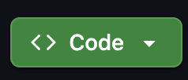
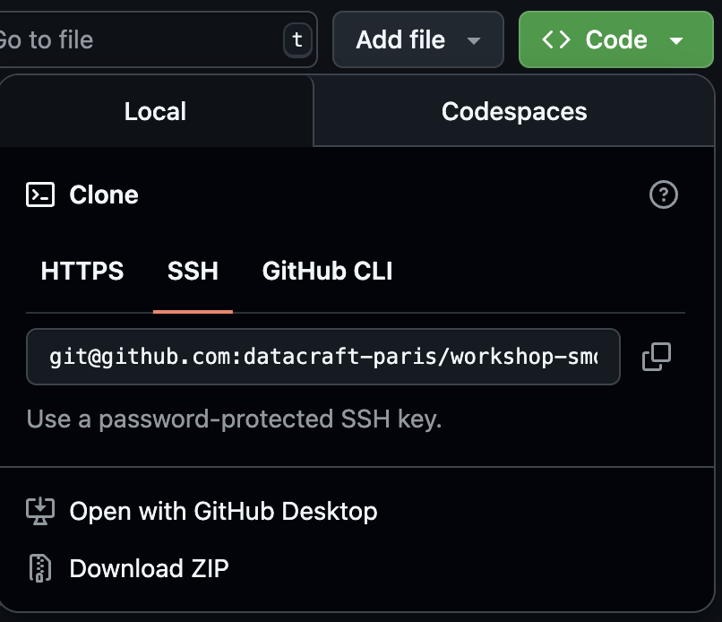
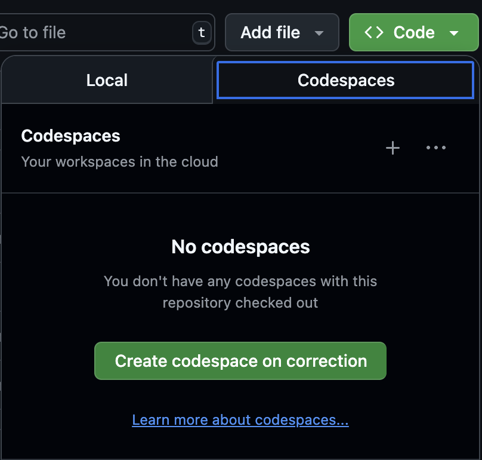

# GenAI Workshop - Building AI Agents and MCP Servers

## Getting Started

### Local Setup

1. Install [uv](https://docs.astral.sh/uv/getting-started/installation/):
```bash
curl -LsSf https://astral.sh/uv/install.sh | sh
```

2. Install the dependencies:
```bash
uv sync
```

3. Activate the virtual environment:
```bash
source .venv/bin/activate
```

### Cloud Setup (Github Codespaces)

1. Checkout your desired branch on the web interface
2. Click on the `Code` button on the right



3. Click on the `Codespaces` tab



4. In the `Codespaces` tab, click on the `Create codespace on XXX` where `XXX` is the branch you want to use




Wait for initialization to complete (approx. 5 minutes), and you should be able to start the workshop!

## [Start the workshop](./workshop_schedule.md)

Now, you can get started with the workshop, by looking at [this file](./workshop_schedule.md)